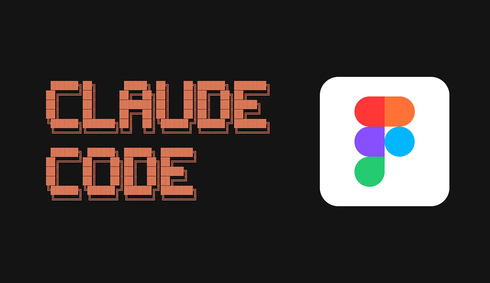
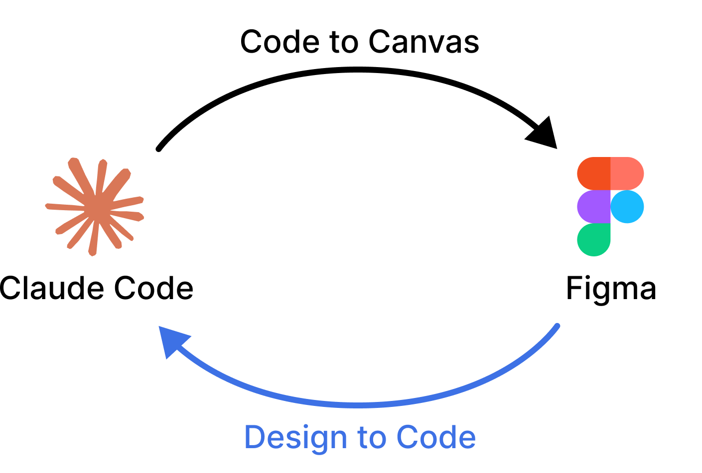
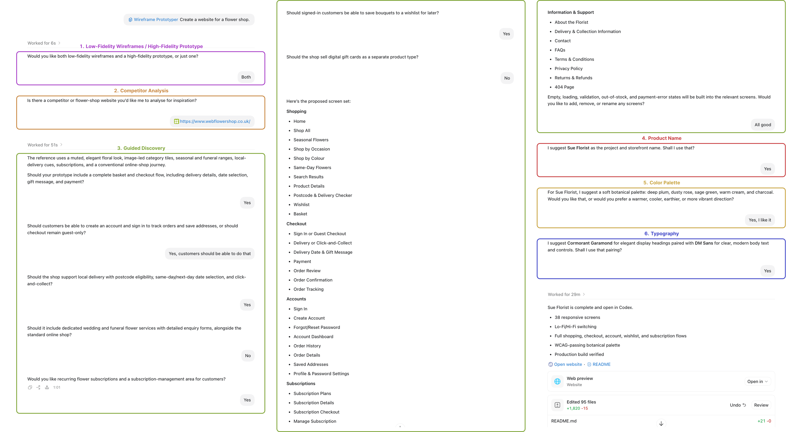
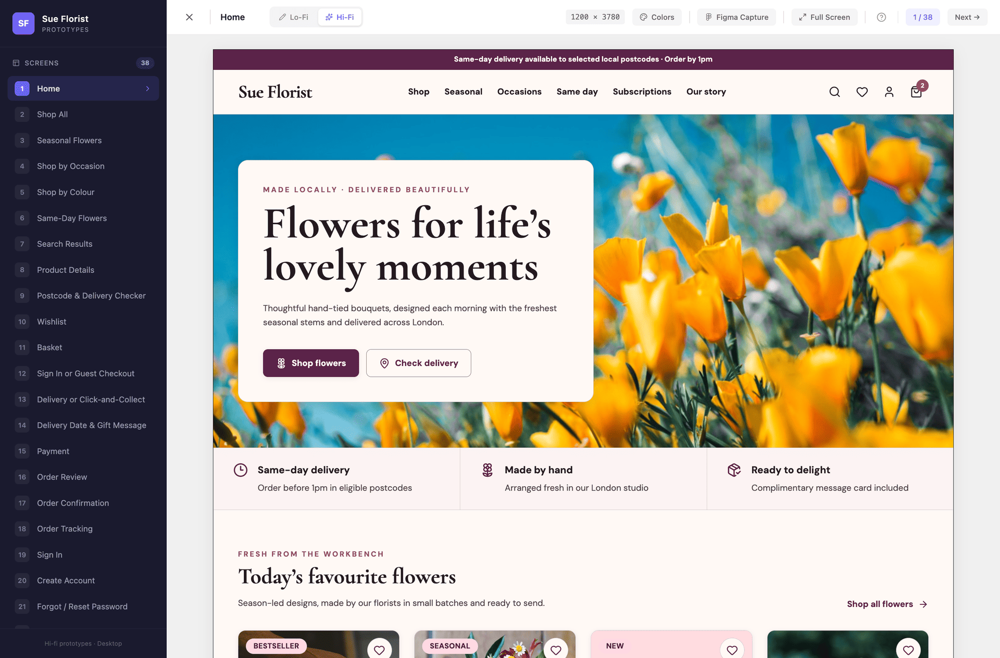
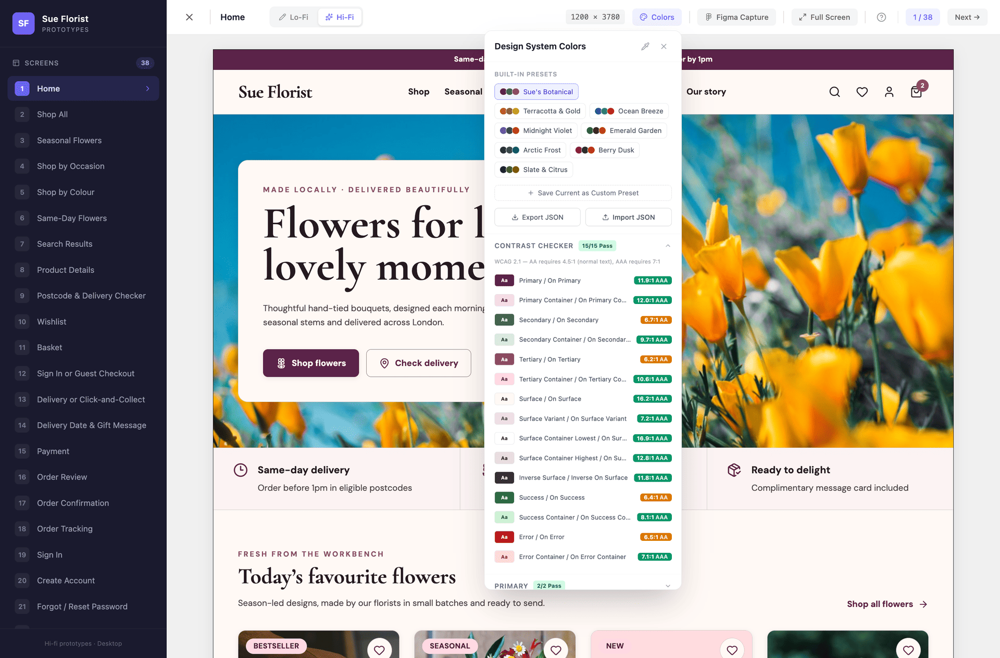
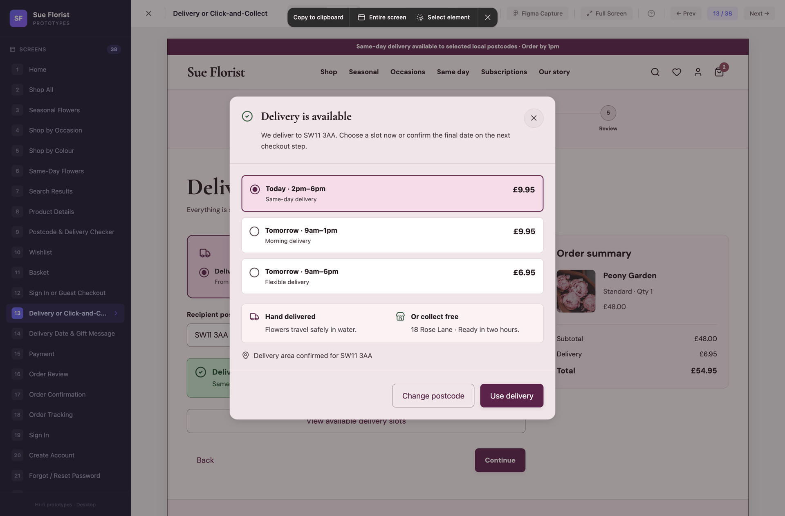
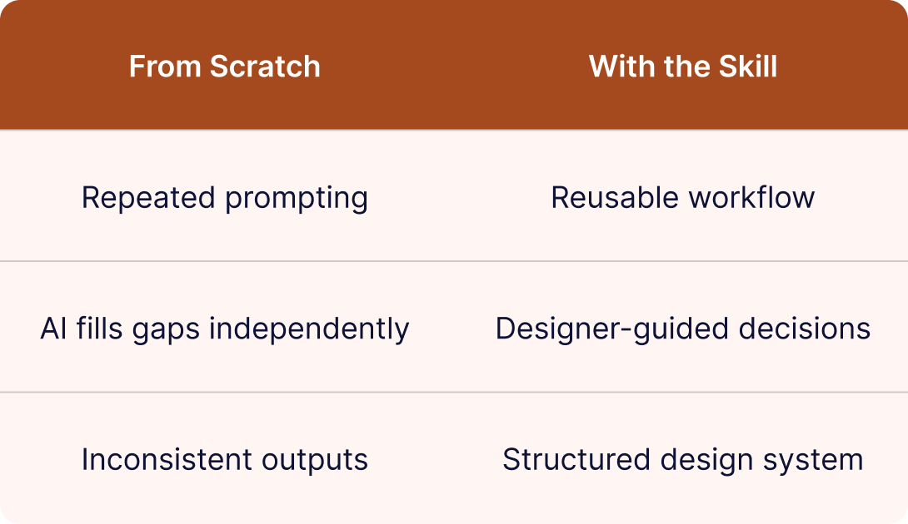

# Wireframe Prototyper Skill

A reusable Claude Code Skill that streamlines the end-to-end design workflow, from structured discovery and competitor research to generating a WCAG-compliant design system and building interactive low-fidelity wireframes or high-fidelity prototypes with real navigation, exportable screens, and a transferable design system to Figma.

[Read on my Personal Website](https://elifsuates.com/wireframe-prototyper) · [Read on Medium](https://medium.com/@elifsue/design-with-context-a-claude-skill-that-studies-competitors-and-builds-your-prototype-e4cdd8cb7519) · [Watch on YouTube](https://www.youtube.com/watch?v=EIryl8x3PCI)



---

## Overview

Wireframe Prototyper is a reusable AI design skill that turns an initial project brief into a structured design workflow. It guides the designer through discovery, competitor analysis, screen planning and accessibility considerations before generating low and high-fidelity prototypes with functional navigation, WCAG-compliant Material 3 color palette, reusable components and screens that can be transferred to Figma for further refinement.

It was created to reduce repetitive prompting while keeping the designer in control of key decisions.



## Key Capabilities

| Capability | What it does |
|---|---|
| **Low-Fidelity Wireframes** | Generates black-and-white wireframes with placeholder content, crossbox image placeholders, and simplified layouts, ideal for rapid ideation and early stakeholder feedback. |
| **High-Fidelity Prototypes** | Creates polished, interactive prototypes with full styling, real navigation between screens, and interactions ready for usability testing. |
| **Competitor Analysis** | Conducts structured competitor research by analysing existing products in the space, identifying UX patterns, strengths, and gaps to inform design decisions. |
| **WCAG-Compliant Design System** | Automatically generates a design system with accessible color contrast ratios, typography scales, spacing tokens, and component guidelines that meet WCAG 2.1 AA standards. |
| **Material 3 Color Palette** | Generates a configurable Material Design 3 color palette with accessible pairings across primary, secondary, and tertiary tones. |
| **Exportable Screens & Design System** | Outputs production-ready screens and a transferable design system that can be directly imported into Figma for handoff, iteration, and team collaboration. |

## The Interview Process

When a user starts a new project, the skill begins by interviewing them. It asks questions one at a time, waiting for the user's response before moving to the next:

1. **Fidelity scope** — Does the user need Lo-Fi wireframes, Hi-Fi prototypes, or both?
2. **Competitor analysis** — Is there a similar website to study?
3. **Feature clarification** — Tailored questions about the specific project. "Does the project need user authentication?", "Should there be a messaging system?", "Is a payment flow required?", etc.
4. **Screen list** — Based on the user's answers, the skill suggests a comprehensive list of screens grouped by section.
5. **Color palette** — What vibe does the user want? Warm? Earthy? Vibrant?
6. **Typography** — Font selection with Google Fonts integration.

This interview process is helpful, by making the user think about things they might have overlooked, while helping the user ensure that nothing gets built until the scope is clear.



## Skill Output

### Screens Sidebar — to navigate through the screens

The left sidebar gives the user an overview of the entire project. Every screen is listed, numbered, and clickable. The screens are linked through working navigation.



### Fidelity Mode Switches — to toggle between wireframes and hi-fi prototype

The toolbar allows the user to switch instantly between Lo-Fi (the structural skeleton) and Hi-Fi (the full visual experience). Starting with Lo-Fi encourages the user to focus on structure and flow before getting distracted by colors.


### The Color Palette Tool — to customise the website's WCAG-compliant color palette

Instead of writing prompts to change colors, the user can simply click. The tool includes the generated website's Material 3-based color palette from the user's prompt, built-in presets, and a live WCAG contrast checker. When the user clicks a preset, the entire prototype recolors instantly. The user can also create and save custom presets, then export palettes as JSON to share across projects.



### Figma Capture Mode — to allow importing screens and dialogs into Figma

When Figma Capture Mode is turned on, dialogs and dropdown menus will not auto-dismiss when the user clicks outside them. This allows the user to capture screenshots of open dialogs and dropdowns without triggering their dismissal when clicking on the Figma Capture tool. The feature is specifically designed to allow the user to import dialogs and dropdowns into Figma using [Figma's Code to Canvas feature](https://developers.figma.com/docs/figma-mcp-server/code-to-canvas/) through [Figma MCP](https://www.figma.com/mcp-catalog/).



## Why Use the Wireframe Prototyper Skill?

The Wireframe Prototyper Skill enables rapid generation of interactive wireframes and prototypes directly from natural language prompts. It bridges the gap between ideation and implementation by allowing designers and developers to quickly visualise UI concepts without manual design tool work.

The Wireframe Prototyper Skill solves this by providing:

- **Structured discovery** — Upfront questions prevent wasted iterations later.
- **Reusable templates** — The skill carries its own component templates, so AI does not need to reinvent them every session.
- **Pre-loaded rules** — Design rules, accessibility requirements, and spacing systems are already defined.
- **Batch efficiency** — The skill knows to build all components first, then screens, minimising context-switching.



---

## Installation

Clone the repository into your skills directory.

**Personal skill** (available in every project):

```bash
git clone https://github.com/elifsue/wireframe-prototyper-skill \
  ~/.claude/skills/wireframe-prototyper
```

**Project skill** (checked in alongside a single project):

```bash
git clone https://github.com/elifsue/wireframe-prototyper-skill \
  .claude/skills/wireframe-prototyper
```

For Claude apps that accept uploaded skills, zip the repository folder and upload it as a skill instead.

## Usage

Tell the agent what you want to prototype and reference the skill by name:

> "I want to create wireframes for a second-hand children's clothing marketplace. Use the wireframe-prototyper skill."

The skill then runs its interview, sets up the project, builds the design system components, builds each screen, and verifies compliance before handing back a running web app.

Once the prototype is running, you can:

- Switch fidelity modes from the toolbar (or press `T`).
- Change colors with the Color Palette Tool — no prompts needed, just click and pick.
- Present without UI chrome using Full Screen (`F`).
- Ask the agent to modify existing screens or add new ones.
- Turn on Figma Capture Mode to screenshot dialogs and dropdowns for import into Figma.

**Keyboard shortcuts:** `←` / `→` previous and next screen · `T` toggle Lo-Fi / Hi-Fi · `F` full screen · `Esc` exit full screen or close overlay · `?` show shortcuts.

## Workflow

```
Discovery Questions → Project Setup → Design System Components → Screen Implementation → Compliance Verification
```

Phase 5 is mandatory: the skill audits every screen against the design rules, the Hi-Fi requirements, and the Lo-Fi requirements before delivering the result.

## Built-In Color Presets

The skill ships with 7 palettes that all pass WCAG AA contrast requirements. The palette generated from your own prompt is added as the first preset and becomes the default.

| Preset | Primary | Character |
|--------|---------|-----------|
| Terracotta & Gold | Warm terracotta | Earthy, organic |
| Ocean Breeze | Cool blue | Fresh, professional |
| Midnight Violet | Desaturated purple | Calm, creative |
| Emerald Garden | Rich green | Natural, grounded |
| Arctic Frost | Steel blue-grey | Minimal, technical |
| Berry Dusk | Magenta-berry | Bold, energetic |
| Slate & Citrus | Dark slate | Sharp, modern |

## Repository Structure

```
wireframe-prototyper-skill/
├── SKILL.md                                  ← Main skill instructions (5-phase workflow)
├── references/
│   ├── COMPLIANCE_CHECKLIST.md               ← Phase 5 verification checklist
│   ├── DESIGN_RULES_REFERENCE.md             ← Rules common to both fidelity modes
│   ├── HIGH_FIDELITY_PROTOTYPE_REFERENCE.md  ← Hi-Fi specific rules
│   ├── LOW_FIDELITY_WIREFRAME_REFERENCE.md   ← Lo-Fi specific rules
│   ├── M3_COLOR_ROLES_REFERENCE.md           ← Material Design 3 color system guide
│   └── TEMPLATES_REFERENCE.md                ← Template descriptions and folder mapping
└── templates/
    ├── AppShell.tsx                          ← Shell wrapper (sidebar + toolbar + canvas)
    ├── ColorPaletteTool.tsx                  ← Color system editor with WCAG checker
    ├── DesignSystem.ts                       ← DS token object with live sync
    ├── DesignSystemContext.tsx               ← Color state and preset management
    ├── dsPresets.ts                          ← Built-in palettes (yours goes first)
    ├── FidelityModeContext.tsx               ← Fidelity mode toggle context
    ├── ImagePlaceholder.tsx                  ← Image placeholder (crossbox / real image)
    ├── projectConfig.ts                      ← Project name & initials for sidebar logo
    ├── routes.ts                             ← Route constants
    ├── screens.ts                            ← Screen definitions
    ├── ScreensSidebar.tsx                    ← Left sidebar with screen navigation
    ├── TextPlaceholder.tsx                   ← Text placeholder (bars / real text)
    └── Toolbar.tsx                           ← Top toolbar with fidelity toggle and tools
```

## Requirements

- An agent with skill support — built for Claude Code, and demonstrated running on Codex.
- A web development environment; the generated prototype uses React, Tailwind CSS, and Vite.

## License

MIT — see [LICENSE](LICENSE).
